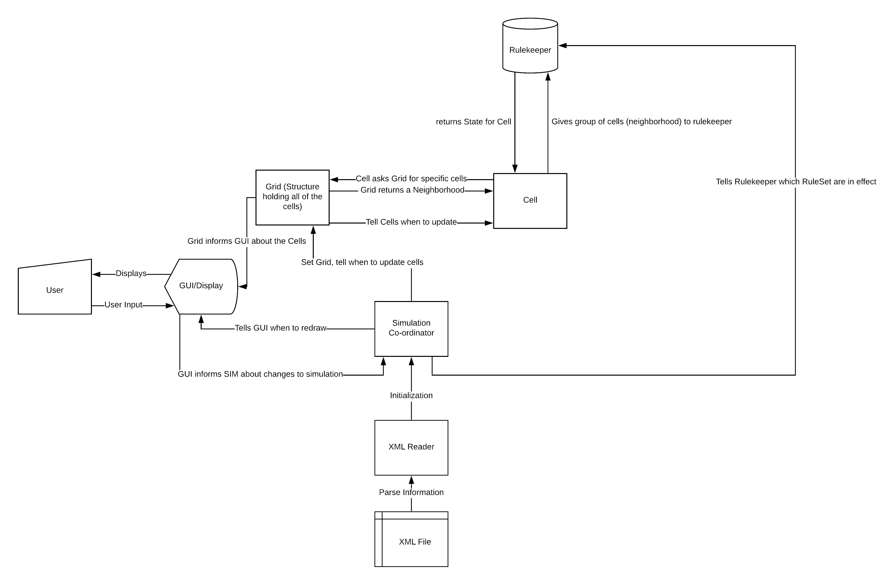
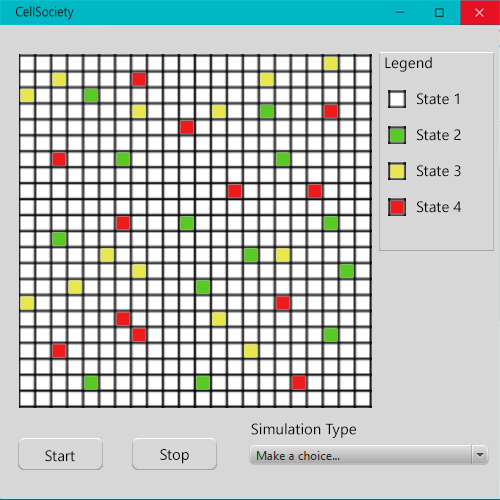

Cell Society 
Design Plan
===========

## Introduction

### Problem Definition 
Create a versatile program to model any 2 dimensional cellular automata simulation. The cells in the simulation must be able to switch between multiple states based off of the state of other cells around them, and there must be a "grid" visualization accompanying the simulation.
### Primary Design Goals
Build a flexible simulation framework that can be used to simulate several different rule sets including state reliance on different sets of cells, different starting configurations, and different cell types.
### Primary Architecture
We would like to keep components as separate as possible. If a class doesn't 
need to know, it should not know, and should definitely not be able to modify priviledged information. 

There should be a ruleset, which is open to be extended for a variety of rulesets. The ruleset should communicate the application of rules (resulting States) to particular cells, but should not expose the actual rules where possible. A Rulekeeper can hold the possible rulesets. 

A cell should be able to represent a variety of different cell types, and have a standard communication contract (regardless of the exact cell type) with others to calculate state changes or to share state information. It's internal information should be private, and others should not be able to modify it.

The GUI is in charge of knowing what to display, and handling user input. Any information not directly tied to these goals should not be included here. It should be able to display a variety of different game types, or support varying other features/parameters.

## Overview

### Verbal Map of Design

#### Cell
The first major class we decided to create was a Cell class, which will hold a State (possibly the current and future state), its own position, and is aware of its "neighboring" cells (aka neighborhood), and should have a way to update itself depending on the state of its neighborhood. A Cell should know its own present and future state, which it can communicate to others. It should remember its own neighborhood. It should communicate with a ruleSet to determine its next state, given its neighborhood.
#### Grid
The Grid will be the structure that holds the cells. This object will allow access to all the cells in an organized manner. The Grid should communicate with the GUI, and should know how to tell its cells to update. 
#### SimulationCoordinator
The SimulationCoordinator's primary job is to make sure the other pieces execute at the right time, and in the right order. It takes in data from the GUIManager based on user input. It tells the Grid when to update cells.
#### Neighborhood
A Neighborhood represents the group of relevant information from cells that affect a particular cell's next State. Each Cell has its own Neighborhood. This neighborhood should be determined upon initialization. 
#### State
The State class enumerates the allowed states of cells.
#### XMLReader
The XMLReader class will read the XML file and create a RuleSet object based off of which simulation is called to be run in the file. It will pass the allowed states to the State class, the initial configuration and states of the Cells to the SimulationCoordinator class, and pass the grid size and game information to the GUIManager class.
#### RuleSet
The RuleSet class will be abstract, with subclasses representing each of the games. It will have information such as how the State of a Cell is calculated.
#### GUIManager
The final class is the GUIManager. This will display the current state of all of the cells and update with every step run in simulation.
### RuleKeeper
Holds several RuleSets so that we can switch between the games. 

### Visual Map of Design

## User Interface
* Overall Appearance of User Interface:
The user interface will be a single JavaFX window containing the grid of cells, a legend that defines which cell colors correspond to which simulation states, a "Start" button, "Stop" button, and simulation type selection dropdown menu in case the XML file contains multiple types.

* Description of User Interaction:
In addition to buttons and dropdown menus for controlling the simulation, the user will be able to press Enter to start a simulation, Escape to stop a simulation, and Space to pause a simulation.  
  
  Errors and status messages will be displayed to the user in the Java console. Such error methods will include: bad XML file, file not found, and initial states not allowed.

* Drawing of Basic Interface: 

## Design Details
### Description of Program Components
#### Cell
The Cell object will have instance variables that record what its current state is and will also be able to hold what its next state is, after the updated state is calculated using all of its neighboring cells' current states. It will also be able to tell the GUIManager if it has been changed or not, so the GUIManager knows whether or not to update its visualization. Each cell will also know its location in the grid, corresponding to a row and column number. 
* Methods 
    * private void setNextState();
    * public State getCurrentState();
    * public State getNextState();
    * private Neighborhood getNeighbors();
    * public boolean getChanged();
* Variables
    * private boolean hasChanged;
    * private Position myPosition;
    * private Neighborhood myNeighborhood;
    * private State myCurrentState;
    * private State myNextState;

#### Grid
The Grid will be an object containing all Cell objects that are currently involved in the simulation. This will allow us to update all of the cells and update the GUI only once per step instead of once for every cell that changes within a step.
* Methods
    * private void createCells(int[][] cellLocations);
    * public void updateGrid();
    * public int getWidth();
    * public int getHeight();
* Variables
    * private int myWidth;
    * private int myHeight;
    * private List\<List\<Cell>> myCells;

#### GUIManager
The GUIManager will be in charge of the visualization of the state of all of the cells in the created grid. It will be updated every step that occurs in a simulation, and will be able to check if a cell was updated in the last calculation and if it was, change the visual state of the block.
* Methods
    * private void initializeGUI(Scene scene, Grid grid, List\<State>);
    * public void updateGUI(Grid grid);
    * private void updateCellColor(int row, int col);
    * public void keyboardHandler(Keycode k);
    * public void GUIListener();
    * private void drawText(String message);
    * private void drawLegend(List\<State>);
* Variables
    * private enum stateColors;
    * private Button myStart;
    * private Button myStop;
    * private ComboBox myRuleSelector;
    * private Stage myStage;
    * private Scene myScene;
    * private GridPane myGridPane;

#### SimulationCoordinator
The SimulationCoordinator class will be in charge of running the game, stepping through the simulation and calling for updates in each step. It will create the Grid which creates and holds the cells, and create the scene that will be used to visualize the simulation. It will also house the main method that that enables the simulation to run.
* Methods
    * private void start();
    * private void stop();
    * private void advance();
    * private void reset();
    * private void step(); //controls real-time application operations
    * 

#### XMLReader
The XMLReader will read the XML file and pass relevant information to the SimulationCoordinator. The SimulationCoordinator will then pass allowed states to State, grid size and game info to the GUIManager, and the simulation parameters to RuleKeeper.
* Methods 
    * private void readXML(File XMLfile);
    * public String[] getAllowedStates();
    * public int[][] getInitialState();
    * public int getGridSize();
    * public String getGameInfo();
    * public String getSimParameters();

#### State
State is an enum type, which will enumerate what states a cell is allowed to have, in a very readable manner. 

#### RuleSet 
RuleSet will be an abstract class that defines a game. It will have access to which neighboring cells the updated state of the current cell relies on, and the formula used to calculate the next state. The RuleSet class will be highly versatile, as each new game that we want to create can be created through the use of a subclass and no other major changes to the code. 
* Methods
    * public void update(Grid testGrid);
    * public void setParameters(); //depends on subclass simulation

#### RuleKeeper
RuleKeeper will have multiple RuleSets, so when the kind of simulation is changed the program can seamlessly switch between the desired games.
* Methods
    * private void updateType(RuleSet simType);

### Use Cases
1. Apply the rules to a middle cell: to set the state of a middle cell, the cell (which knows all of its neighbors) will be passed to the update function of a RuleSet object. It's next state will be calculated based off of the neighboring cells' states, and put into the cell object's nextState variable.
2. Apply the rules to an edge cell: We will have to do some experimenting with edge cells for each of the game. Several ideas that we have include keeping edge cells static, treating all "neighboring" cells that would be out of bounds of the grid as a single state, or having the edge cells rely on the opposite sides edge, as if the grid wrapped around like a cylinder. 
3. Move to the next generation: The simulation will move to the next generation once all of the cells have been updated, and that update has been passed to the GUI. Basically, each time the step function is called in simulation a new generation will be calculated and updated. 
4. Set a simulation parameter: The simulation parameters will all be held in the RuleSet object. We will have paramaters such as probability, depending on the game, that can be passed into the RuleSet object to customize its update method. 
5. Switch simulations: We will be able to switch simulations by taking the GUI input simulation from a dropdown, and running the simulation with the RuleSet of that type. 

## Design Considerations
### Treatment of Edge Cells
We are still not entirely certain as to how edge cells should be treated in the simulation. 
Because they lack the common 9 neighboring cells that all other cells have, 
it is difficult to say how should be updated, or if they should be updated at all. 
We cannot say for certain whether they should be static, dependent on only their 3 or 6 surrounding cells, 
or if they should be dependent on the opposite edge as if the simulation wrapped around.
There are many options available. We will seek to create our Cell class in a flexible manner that avoids
"special hardcoding" for edge cells wherever possible.  

### Location of the main function
We ended up deciding to put the main function in SimulationCoordinator instead of GUIManager because we realized that we can pass the stage to the GUIManager a single time at the beginning, and still manage to start and step through the SimulationCoordinator.

### Where to create cells
We decided to create the cells in Grid to stop SimulationCoordinator from becoming too cluttered. We wanted SimulationCoordinator to be more of an intermediary between the classes, and it had begun to contain too much information and take on too much of the responsibility of our program so we shifted the creation of cells to the grid class.

## Team Responsibilities

### Lucas
Will primarily handle the simulation logic. This involves handling most of the work with the cells, rulesets, rulekeepers, simulationCoordinators, and grids. As a secondary role, the simulation will bleed into the other two members roles, particularly where communications occur. 

### Ian
Will primarily handle the configuration in the project, handling the parsing of the XML file and connecting it to different aspects of the simulation with a focus on veratility to be able to account for the creation of as many different simulation variants as possible. Will be secondarily a part of the simulation, especially linking the configuration with the simulation.

### Harry
Will primarily handle the front-end visualization and user interface aspects of the project, including GUI implementation and user input handling. Secondarily, will handle relevant areas of the simulation classes that impact the GUI.